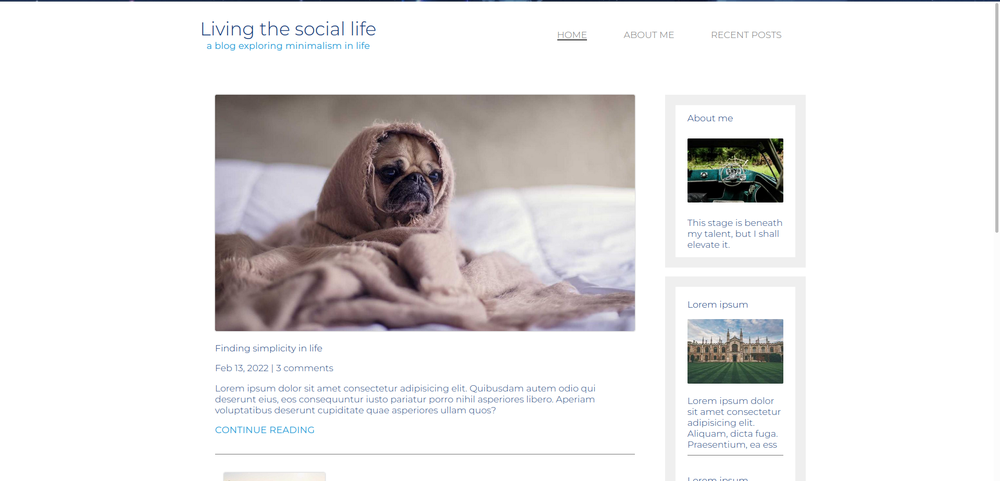

# Responsive Design 
Responsive-Design is an article website. The project built using HTML, CSS. The project contains 3 pages, home page, about-me page, and the recent articles. All of these pages are responsive.

I used the pure web (HTML, CSS) because there's no complex functionalities inside the site. 

There's problems faced by me in responsive but not a deal to list it. When the window size is 675px, the arrangement of the site will change immediately. 

## how to run
You can directly open index.html using any browser. Also, you can run it on a live server in your vs code. Run it and test :)
## Frist Looks
### Desktop 

### Mobile

